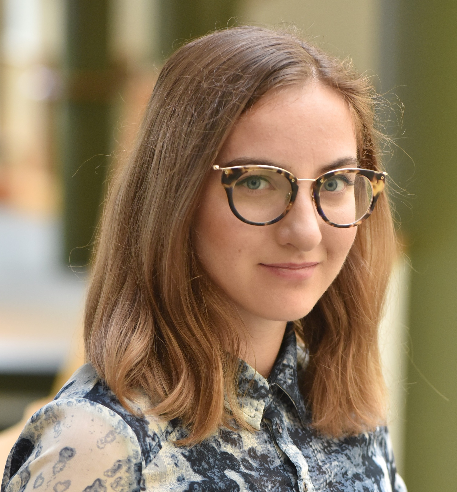

<link href="style.css" rel="stylesheet">

  

 I'm postdoctoral fellow in Genetic Medicine at Vanderbilt University Medical Center. My work broadly uses high-dimensional omics measurements to understand complex, multifactorial disease.
My doctoral training has included work in epidemiology, statistical genetics, and bioinformatics. 

I also love reading, gardening, & dogs.
