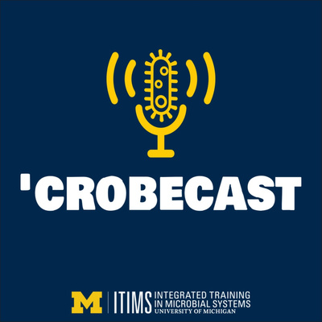

# Crobecast: an ITIMS podcast

Do you know what's up with what's below your feet? Together with fellow University of Michigan graduate students Nicholas Medina and Emily Crossette I produced and hosted a podcast exploring the science of soil! In this three episode mini-series, we dive into the soil crisis by interviewing President Obama’s science advisor, Dr. Jo Handelsman, and an innovator in the green ag industry, Keith Heidecorn of Locus AG.  This podcast was supported and made possible by the University of Michigan Integrated Training in Microbial Systems program. Check out "CROBECAST" on [Spotify](https://open.spotify.com/show/1m8u70VQkQPbyPhd8fOQ5Q), [Itunes](https://podcasts.apple.com/us/podcast/crobecast-an-itims-podcast-on-microbial-systems/id1547941151?uo=4) and [more](https://anchor.fm/itims-podcast)!  

